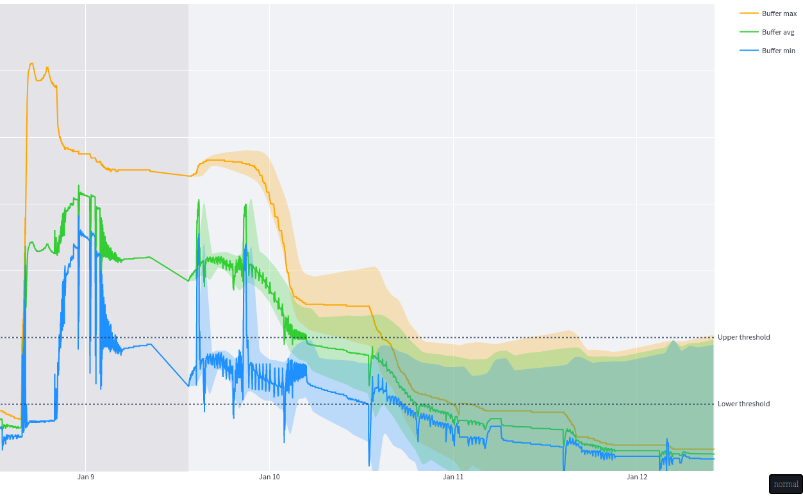
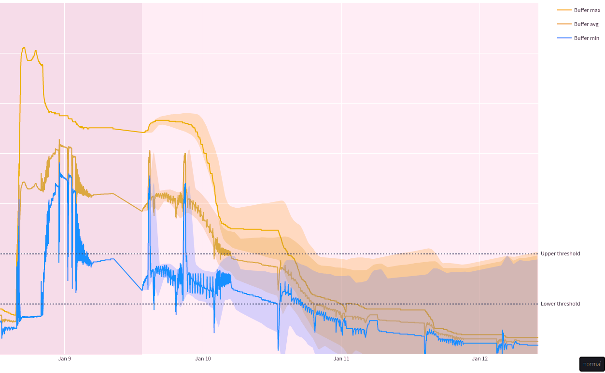
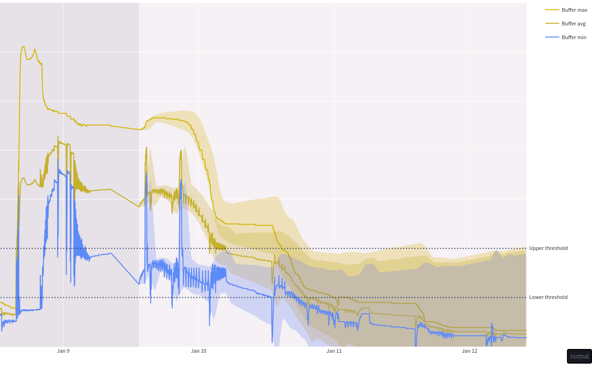
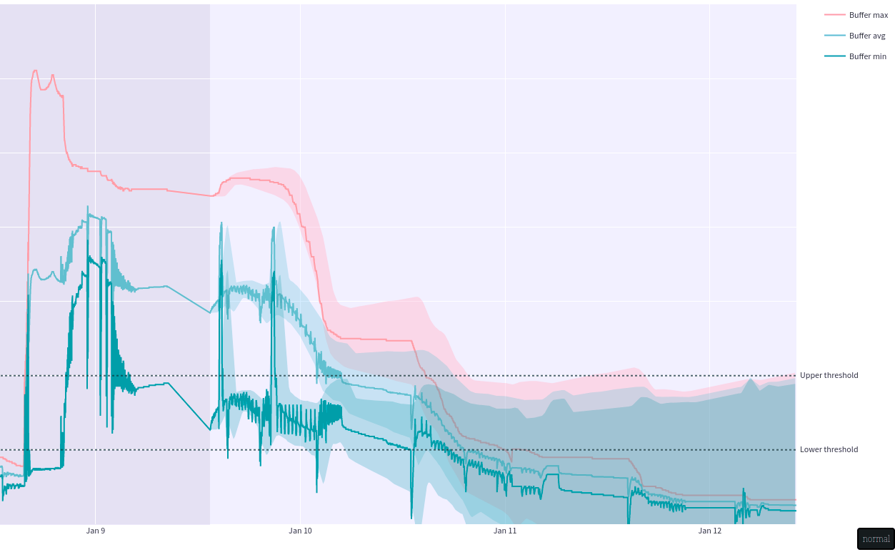
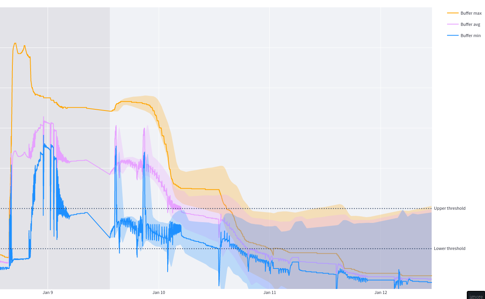
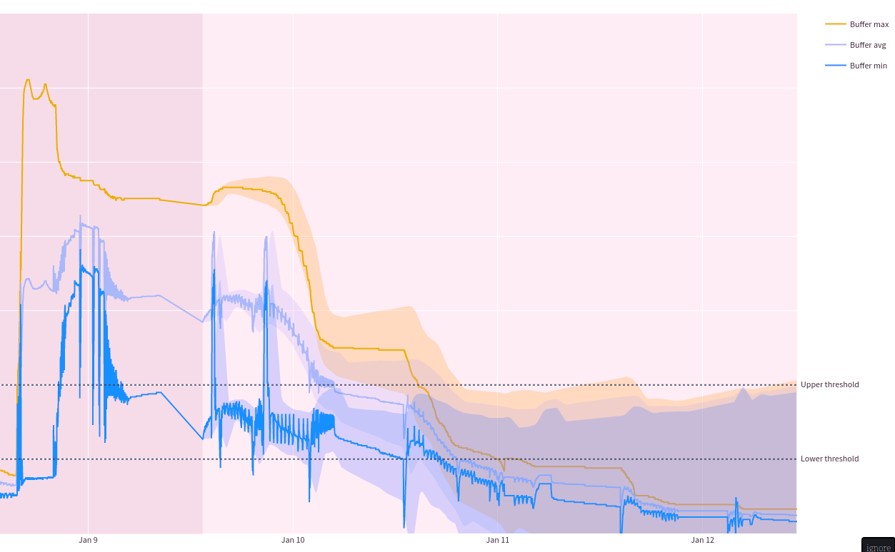
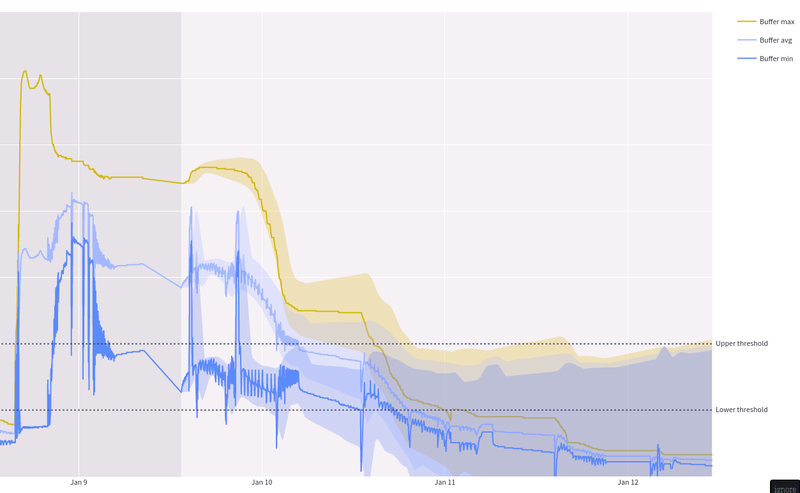
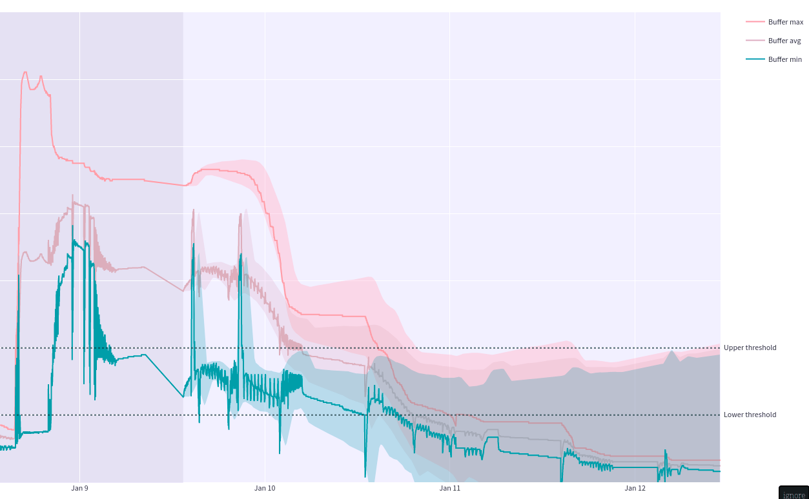

# DVIZ HSLU HS22 - Joel L.

## Motivation

In 2019, I got the opportunity to interface the heating unit in our house with a serial port.
It didn't take long for me to start a real-time dashboard around the data I managed to extract,
to help me find my footing in the world of web development and build a full-stack application from A to Z.
The heating unit outputs a stream of CSV data containing the current values of the sensors within.
At first, I only used this data for the dashboard in real-time, but soon I started storing it in 10 min intervals
and in lockdown 2020 I switched to archiving in 1 min intervals. \
This data source allowed me to build a tool for my family with which they can check the current temperatures
without having to go down to the actual heating unit.
This is especially helpful because it's a wood system, so you have to manually put in wood and
light it when you see the temperature is running low. \
I also plan to use this data to train a forecasting model in hopes of further optimizing timing
for firing up the furnace and the amount of wood we use.

However, this dashboard I built is from a time when I understood very little about the heating unit, and therefore it's
just numbers on a screen without much thought behind them and also very boring from a visualization point of view. \
With this project I would like to change this, learn how to correctly identify needs and how to build an
intuitive and helpful visualization around the data I collected.

The different components for extracting the data, storing it, making it consumable (API) and displaying it (web UI / dashboard),
etc. are all [Open Source](https://github.com/Joelius300/HeatingDataMonitor).

## Process

A brief summary of the process used to develop and create this visualization dashboard:

1. Gather ideas (already had something in mind)
2. Discuss current process with representative of target audience and identify needs
3. Create rudimentary paper prototype during that meeting and sketch a guideline for a first real prototype
4. Explore and analyze data to prepare the features that can be used to assist the target audience in their task
5. Play around with Grafana to try out different chart types and ideas
6. Create a more thought-out paper prototype and refine iteratively with feedback from same representative as well as professor
7. Create Streamlit & Plotly dashboard
    1. Data loading and preparation
    2. Layout with simple charts
    3. Add more complex elements step-by-step
    4. Refine styling
    5. Final code cleanup (much refactoring done iteratively)

## Data exploration

This dataset has had my interest for quite a while now, and I have already done some data exploration
and data analysis outside this module. The many hours I have invested into this already were mostly
for my personal interest and general analysis of the dataset, so I was able to use it in multiple modules.
In the work summary, I have only written down hours for the data exploration and data analysis where
DVIZ was an intended primary beneficiary. For the analysis done specifically for other modules I have of
course still taken the insights into account if they were relevant but did not count the hours towards
this project.

### Key findings

#### Meaning of columns

Some columns required investigation to interpret correctly. One of which is the operation state of the furnace
("betriebsphase_kessel"), which uses an undocumented discrete number encoding.
In this project this column was used indirectly by reducing it to a boolean "heating_up" to rectify impossible predictions.

Here are the meanings of the used columns:

- **received_time**: Time the system received this state of the heating unit in UTC
- **buffer_max**: Temperature in °C of buffer at the highest point (usually highest temperature because the water is layered by temperature ascending).
- **buffer_min**: Like buffer_max but lowest point of the buffer (usually lowest temperature)
- **drinking_water**: Temperature in °C of drinking water inside storage water heater at the highest point (highest temperature but mixed fairly well)
- **heating_up**: Whether the heating unit is in the process of heating up, initiated by hand

#### Heating progression to lowest point

To avoid showing impossible predictions, an analysis was done to determine a suiting past heating cycle
that went as low as possible for the most relevant columns.
This heating progression (highest to lowest point) is then used to replace invalid parts of predicted progressions.
Heating up in a prediction is invalid because it could
only happen if the user manually fired up and the user wants to see the progression if they don't fire up.

## Target audience

The target audience is my family with my dad being the most important stakeholder
as he manages the heating unit the most. \
To determine the needs of this user, I had a meeting with him where we discussed
the current workflows and how decisions are made with the tools he has available at the moment.

### Persona

Some key information about my father as the target audience:

- Good understanding of the heating unit and the processes related to it
- Tech-savvier than many at their age but certainly needs good UX design to understand dashboard
- No visual impairments
- Decisions to make: When to fire up the furnace (data available) and when to get more wood (no data available)
- Current tools: Knowledge and experience, basic dashboard built by me

### Status quo

Before discussing the takeaways from the meeting, here is a brief explanation of the heating system in place.

Our house has both floor heating and radiators.
Additionally, a storage water heater stores and maintains 600 liters of hot drinking water for all the
water outlets in the house. To provide heat to them, a log heating unit is in place which
regularly has to be filled up with wood and lit on fire manually. As is custom,
the heat generated from burning the wood isn't (all) used to supply the heating circuits and storage water heater
but is transferred into a buffer storage where 3000 liters of heating water are kept.
The heat from this buffer is used to provide hot water to the consuming systems when the furnace isn't burning.

### Key takeaways

#### Existing process

My fathers current process to determine whether firing up is necessary using the existing dashboard is as follows:

Often times a gut feeling results in him checking the dashboard to see the current values.
In winter, all the systems are active and the main source of heat is the buffer.
Since the top sensor shows the approximate maximum temperature, it is a hard limit for heating up
other systems and used as the main reference to determine if firing up is necessary.
In summer however, the heating circuits are disabled, so only the drinking water is relevant and used as reference directly.
The thresholds he uses to determine the need for firing up are as follows: \
If the reference temperature (buffer max or drinking water) is above 40 °C, no action is necessary. \
If it is below 30 °C, it's certainly necessary to fire up,
otherwise the house will cool quickly and no more warm showers are possible. \
If it is between, it depends on many more factors.
Those factors include the number of people at home in the next days, whether a bath is desired,
the current and predicted weather, and more.

These thresholds alongside with a prediction can be used to recommend an optimal time to fire up the furnace.
Still, a more detailed view of the data should be available to assist manual decision-making
with respect to the factors for which there is no data available.

#### Unknown temperature distribution in buffer

For heating up other systems, hot water is taken from the top of the buffer (flow), pushed through the heating circuits
and returned into the bottom of the buffer (return). When heating up the floor heating and the radiators,
a lot of heat is lost, and the return is much colder than the flow leading to a low temperature
at the bottom of the buffer where the bottom sensor is. This can lead to negative spikes in buffer min
before the water mixes and layers again.
On the other hand, when the water goes around the storage water heater to heat the water inside, it doesn't
lose nearly as much energy and the return is often warmer than the water previously at the bottom of the buffer.
Respectively, this causes positive spikes in buffer min that correlate with
an increase in the drinking water temperature. \
Because of these processes happening at different intervals, it's very hard to determine whether
the majority of the water in the buffer is closer to the warmest, or closer to the lowest temperature.
When buffer max and buffer min are substantially different,
an inspection of the analog hardware sensors spread across the buffer may be necessary to determine the best
course of action, especially when the upper threshold has already been crossed.

On the dashboard, there should be an option to show the buffer min for a rough estimation on the stored energy
in the buffer. Due to the unknown distribution, this is verbose and often optional information,
which requires good knowledge of the system, and should be represented as such.

## Visualization breakdown

To help with the decision of when to fire up, a dashboard was built. It is designed to display the state of the
heating unit in the past and coming few days, with a recommended action as well as interactive charts
to explore the data and make decisions. Thanks to customizable thresholds, the recommendations can be tweaked anytime. \
It also allows exploring times in the past, in which case the end of the selected period is treated as if it
were the current time, to simulate how the dashboard would look at different times. If it were a productive system,
data would continuously be added and past periods would be treated differently than current ones.

### Recommendation phrase

The recommendation phrase aims to give a clear and direct statement on the
recommended action in the near future, including the reason for it. \
This distills the relevant information into a single sentence removing the need
to always consult a visualization.

### Temperature charts

The temperature charts are line charts, inspired by the MeteoSwiss mobile weather forecasting chart.
Aside from me simply liking the MeteoSwiss chart, taking inspiration from an app this
wide-spread also brings familiarity to the user, which makes the visualization more intuitive.

A line was used to plot the time series data as a progression of a data point over time. In the case
of this dashboard, the shape of the line is rather simple, especially for the two main values "buffer max"
and "drinking water" within the default period. This allows the user to quickly pick up trends visually
and find the highest and lowest temperatures, which are all important factors in deciding
whether firing up is necessary. Thanks to human's strength in interpreting position and slope encodings,
a chart like this can be interpreted quickly and accurately.

Using a slightly darker background, the values in the past are visually separated from the prediction. \
Said prediction continues the line at the same point with the same color (Gestalt principles) and adds
a fan to show the growing uncertainty in the prediction. This fan isn't fully opaque and uses the line's
color, to once again show they belong together.

Two horizontal dotted lines visualize the upper and lower thresholds and enable the user to estimate the
time of crossing. It doesn't need to be more precise at first glance because of the
inherent inaccuracy of the prediction and the possibility to zoom in if desired.

On the buffer chart a total of three lines are available to display with two of them being hidden by default,
as represented by the less opaque legend entry. Although not directly next to the lines, the items
in the legend follow the logical sort order descending and also represent the relative positions
of the respective lines (max > avg > min).

The charts are zoomable and pannable with additional options such as download as image and full-screen.

For larger time periods, the data is aggregated before plotting to improve performance.

If it was an app, notifications would be a great way to let the user know it's time to heat up but
this is outside the scope of this project and dashboard.

#### Colors

The colors used in the charts have semantic meaning. For higher temperatures (buffer max) a
warm color was used, while a cold color was used for lower temperatures (buffer min). For the
drinking water a color associated with water, blue, was used.

To ensure accessibility, I simulated how the charts would look with different kinds
of color blindness using [Color blindness simulator](https://www.color-blindness.com/coblis-color-blindness-simulator/).
While visibility and contrast are always important, only the buffer chart features more than one color where confusion between
colors could occur.

The first set of colors used for the buffer chart were orange, green and light blue.

Although it seemed fine with the less extreme kinds (Anomalous Trichromacy),
with the relatively common Deuteranopia, the Green-blindness, the chart looked like this:

The less common Protanopia and Tritanopia also lead to very similar colors.

Protanopia \

Tritanopia \

Looking at a great post from NALDZ GRAPHICS ([Improving Web Design For Color-Blind users](https://naldzgraphics.net/web-design-for-color-blind-users/)),
I realized that pink might be a good substitute for green that works with orange and blue.

Even though it slightly decreases the contrast and is also less pretty in my opinion,
it's much clearer under a Deuteranopia or even Protanopia view.

Deuteranopia \

Protanopia \

With Tritanopia it doesn't work as well but luckily this is the least common color blindness.

If all else fails, the consistent order of the line both in the chart and the legend, the meaningful names
and hover-labels of them, as well as the ability to show and hide a particular line,
allow even users with complete color blindness to interpret the chart.

## Tools and libraries

### Streamlit

Streamlit is advertised as a framework to create data apps quickly and simply.
Unlike a data story, this dashboard does not rely on extensive customization on the
layout layer, which a more complex / low-level framework like Dash would allow.  
Since I had no previous experience or knowledge about either contender (Streamlit vs Dash),
I decided to stick with the simpler but less customizable option without regrets.

### Plotly

Plotly is a powerful charting library for creating interactive visualizations using JavaScript.
Thanks to its good Python bindings and great integration into Streamlit, it was a high contender
from the beginning. With its interactivity it beat out the known framework Matplotlib, and with its
popularity and appearance in the module it beat out other options like Altair, Vega-lite and Bokeh.

## Sources

- [Improving Web Design For Color-Blind users (naldzgraphics.net, accessed 09.01.23)](https://naldzgraphics.net/web-design-for-color-blind-users/)
- [Prevalence of Color blindness (colour-blindness.com, accessed 09.01.23)](https://www.colour-blindness.com/general/prevalence/)
- [Deuteranopia - Red-Green Color Blindness (color-blindness.com, accessed 09.01.23)](https://www.color-blindness.com/deuteranopia-red-green-color-blindness/)
- [Color blindness simulator (color-blindness.com, accessed 09.01.23)](https://www.color-blindness.com/coblis-color-blindness-simulator/)
- [Streamlit](https://streamlit.io/)
- [Plotly](https://plotly.com/)
